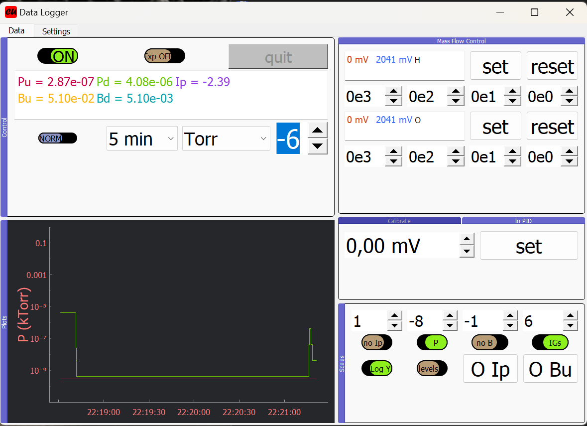
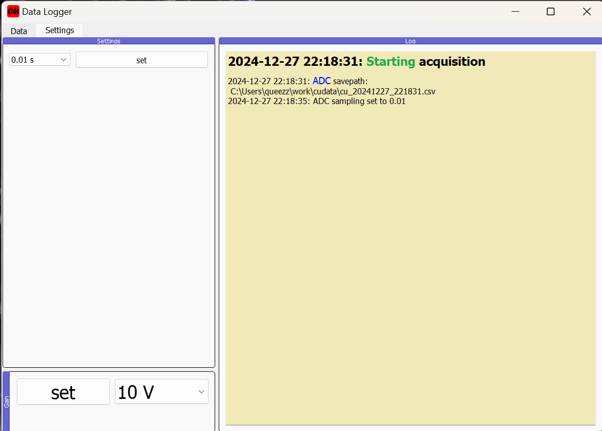
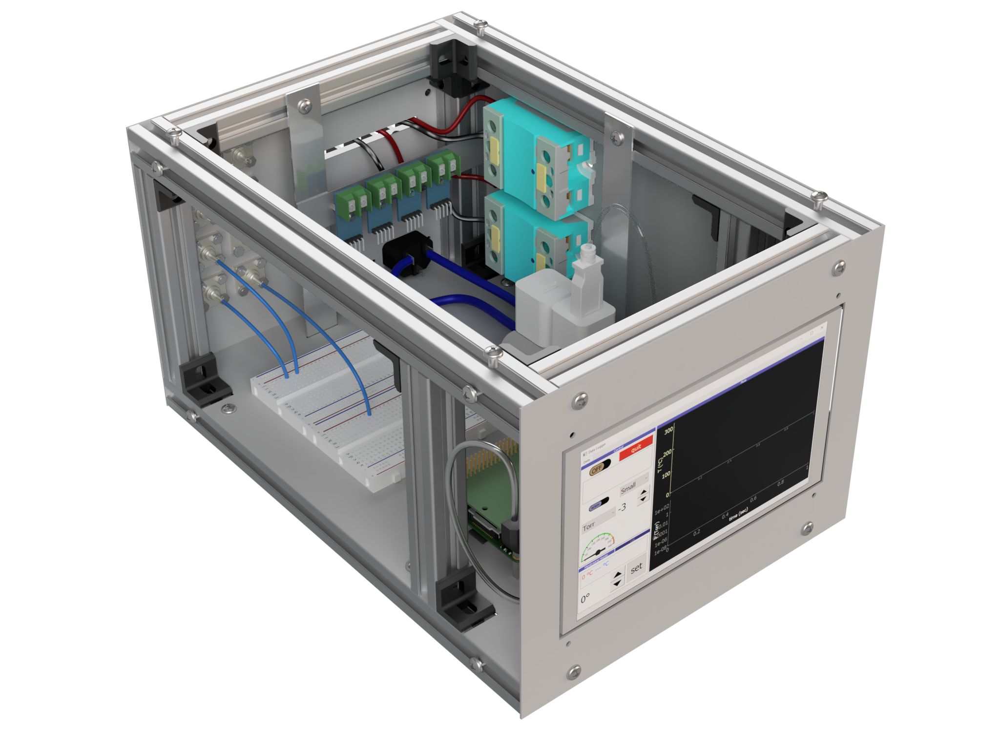
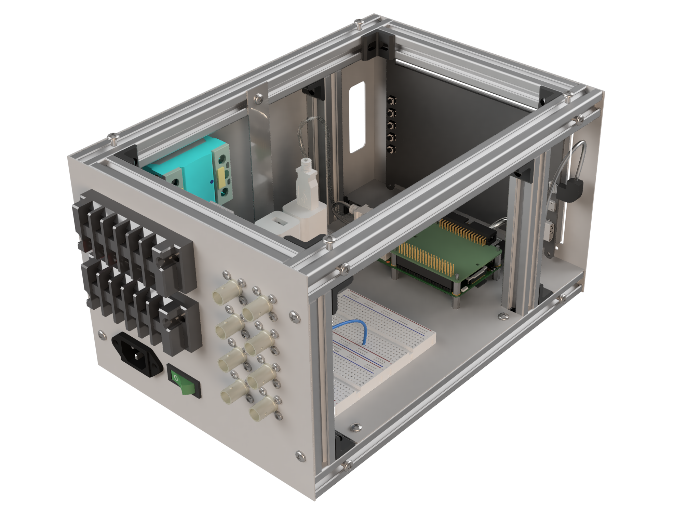

[](https://github.com/psf/black)

# ControlUnit

Raspberry Pi–based control and data-acquisition system for a plasma laboratory.
Logs vacuum and plasma parameters, controls gas flow via MFCs, and runs a
closed-loop PID on plasma current. Built and operated by one principal developer
over six years, with contributions from students and lab-mates passing through.

The box exists. It sits in a multi-chamber plasma lab. It is used today.

## Current status

| Function | State |
|---|---|
| ADC acquisition via I²C (AIO-32/0RA-IRC, 10 Hz) | **live** |
| MFC gas control — H₂ + O₂ via DAC8532 | **live** |
| Plasma current PID via galvanically isolated MCP4725 | **live** (Apr 2026) |
| GPIO sync signal for external loggers (QMS, others) | **live** |
| Membrane temperature control via MAX6675 + SSR | dormant — migrated to NI/Windows |

Hardware: Raspberry Pi 4 (8 GB) + custom PCB.
Runs on-rig; also boots on Windows/macOS with dummy hardware stubs.

## Quick start

On the lab Pi:

```shell
python -m controlunit.main
```

`pigpiod` is started automatically. GPIO access requires the daemon to have
been started with appropriate permissions — on the rig this is handled by
`controlunit/start_gpio.py`.

Off-rig (Windows/macOS — GUI only, no hardware):

```shell
python -m controlunit.main
```

Missing hardware libraries (`pigpio`, `smbus`, `RPi.GPIO`, `spidev`) are
automatically replaced with no-op stubs from `controlunit/devices/dummy.py`.

## Documentation

Full documentation is at **<https://queezz.github.io/ControlUnit/>**

| Page | Contents |
|---|---|
| [Home](https://queezz.github.io/ControlUnit/) | Overview and navigation |
| [Archaeology](https://queezz.github.io/ControlUnit/Archaeology/) | Forensic reconstruction of the full codebase history — primary technical reference |
| [Qt Threading](https://queezz.github.io/ControlUnit/architecture/qt-threading/) | Thread ownership, data flow, and shutdown safety diagrams |
| [Channel Map](https://queezz.github.io/ControlUnit/hardware/channel-map/) | ADC channels, signal names, conversion functions |
| [Related Projects](https://queezz.github.io/ControlUnit/ecosystem/related-projects/) | Ecosystem: echelle_spectra, pihtivacuum, TemperatureControl, tclogger |

Hardware documentation lives in the lab-wide knowledge base:
[aklab-howto](https://queezz.github.io/aklab-howto/hardware/controlunit/control-unit/).

## Repository structure

```
controlunit/        Python package — acquisition, control, UI
  devices/          per-device worker threads + chip drivers
  ui/               pyqtgraph docks and widgets
  settings.yml      channel map + conversion function registry (canonical)
docs/               MkDocs source
  Archaeology.md    primary historical document
archive/pdoc3/      legacy pdoc3-generated HTML (2022 snapshot, preserved)
images/             screenshots and physical box photos
tests/              minimal CI tests
examples/           scratch notebooks from development
```

## Screenshots

|                Controls                 |                Settings                  |
| :-------------------------------------: | :--------------------------------------: |
|  |  |

| Front panel | Back panel |
| :---: | :---: |
|  |  |

## Historical note

This codebase has accreted over six years: a 2020 monolithic worker
template-copied from an earlier spectrograph application (`echelle_spectra`),
extended by students, gradually refactored during experimental downtime,
and still running in the lab. The full story — contributor history, threading
evolution, design decisions, dormant capabilities, and ecosystem context —
is documented in [Archaeology.md](docs/Archaeology.md).
