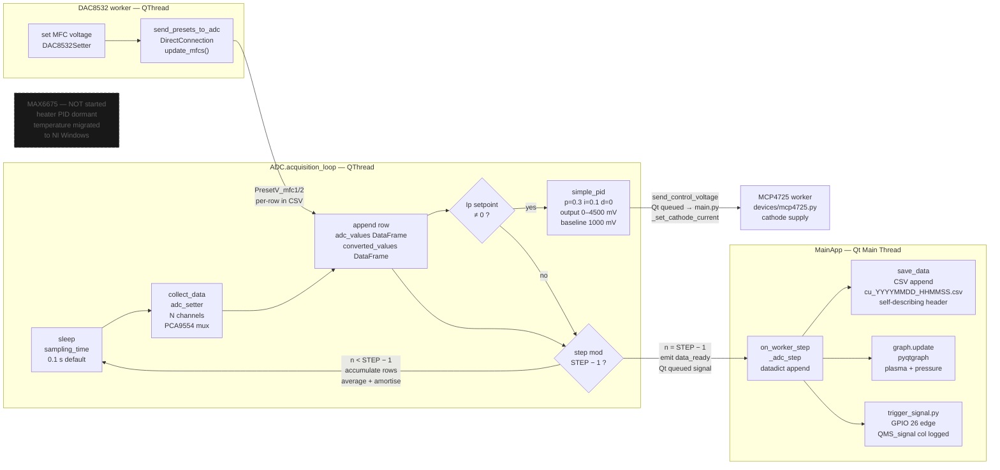

# Qt Threading Architecture

The threading model is the deepest stratum in the codebase — a six-phase
story from a template-copied monolith to a proper per-device worker hierarchy.
Three diagrams follow; the historical narrative is below them.

---

## 1 · Runtime ownership

Who owns what, and in which thread it executes.

```mermaid
flowchart TB
    subgraph GUI["Qt Main Thread"]
        MAIN["MainApp\nQObject + UIWindow"]
        UI["ui/ docks + graph\nControlDock · PlasmaCurrentDock\nGasFlowDock · SettingsDock · LogDock"]
        WDICT["self.workers { }\nQThread parent dict"]
        TRIG["trigger_signal.py\nIndicatorLED\npigpio GPIO 26"]
    end

    subgraph T_ADC["QThread — ADC"]
        WADC["ADC : DeviceThread\ndevices/adc.py\nacquisition_loop\nSTEP batching · simple_pid"]
    end

    subgraph T_MFC["QThread — MFCs"]
        WMFC["DAC8532 : DeviceThread\ndevices/dac8532.py\nMFC H₂ + O₂ voltage"]
    end

    subgraph T_PC["QThread — PlasmaCurrent"]
        WPC["MCP4725 : DeviceThread\ndevices/mcp4725.py\nplasma-current DAC"]
    end

    subgraph T_HT["QThread — MemTemp  ·  DORMANT"]
        WHT["MAX6675 : DeviceThread\ndevices/max6675.py\ncommented out in define_devices\nmigrated → TemperatureControl repo"]
    end

    subgraph CHIP["Chip Drivers — synchronous, no Qt"]
        SADC["adc_setter.py\nAIO_32_0RA_IRC driver"]
        SMFC["dac8532_setter.py"]
        SPC["mcp4725_setter.py"]
    end

    subgraph HW["Raspberry Pi 4 8 GB + custom PCB"]
        BUS_A["I²C bus A\nADS1115 16-bit ADC\nPCA9554 32-ch mux\nDAC8532 MFC outputs"]
        BUS_B["I²C bus B — galvanically isolated\nMCP4725 plasma DAC\nApril 2026 hardware mod"]
        GPIO26["GPIO 26\nsync edge + front-panel LED"]
        MFCS["H₂ MFC 20 sccm\nO₂ MFC 10 sccm"]
        CATH["cathode power supply\n→ plasma"]
    end

    MAIN --> UI
    MAIN --> WDICT
    MAIN --> TRIG
    WDICT --> T_ADC
    WDICT --> T_MFC
    WDICT --> T_PC
    WDICT -. "commented out\nin define_devices" .-> T_HT

    WADC -- "data_ready\n[Qt queued]" --> MAIN
    WMFC -- "sigDone / msg\n[Qt queued]" --> MAIN
    WPC -- "sigDone / msg\n[Qt queued]" --> MAIN
    WMFC -- "send_presets_to_adc\n[DirectConnection]" --> WADC

    WADC --> SADC
    WMFC --> SMFC
    WPC --> SPC

    SADC -- "smbus" --> BUS_A
    SMFC -- "smbus" --> BUS_A
    SPC -- "smbus" --> BUS_B

    BUS_A --> MFCS
    BUS_B --> CATH
    TRIG --> GPIO26

    style T_HT fill:#181818,stroke:#4a4a4a,stroke-dasharray:6 3
    style WHT fill:#181818,stroke:#4a4a4a,color:#606060
```



Key structural notes:

- `MainApp` uses multiple inheritance (`QObject + UIWindow`) — a pattern inherited
  from `echelle_spectra`. `UIWindow` is a mixin in `mainView.py` that keeps layout
  code separate while sharing `self.*` attribute space.
- Worker threads are stored in `self.workers[name]["worker"]` / `["thread"]`.
  `MainApp` owns all `QThread` lifetimes.
- The MCP4725 sits on a **separate, galvanically isolated I²C bus** since April 2026
  — plasma transients on bus A were corrupting the ADC and DAC8532.
- The `MAX6675` / heater path is instantiated in code but its entry in
  `define_devices` is commented out. The code is dormant, not deleted.

---

## 2 · Acquisition data flow

The ADC thread is the busiest path: hardware reads every 0.1 s, data
accumulates across `STEP` ticks, then a Qt queued signal delivers a batch
to the GUI thread for logging and plotting.



The `STEP` counter serves two jobs simultaneously: it averages noisy ADC
readings *and* amortises Qt signal-emission overhead. A single tunable
parameter does both — which is why it has never needed splitting.

```python
# controlunit/devices/device.py
def set_sampling_time(self, sampling_time):
    if sampling_time >= 0.9:  self.STEP = 1
    if sampling_time < 0.9:   self.STEP = 3
    if sampling_time < 0.1:   self.STEP = 5
```

The `send_presets_to_adc` worker→worker signal uses `DirectConnection` (runs
in the emitter's thread) rather than the default queued connection, because
`update_mfcs` only writes to `self._mfc_presets` — a plain dict that never
touches Qt internals.

---

## 3 · Shutdown and safety sequence

Hardware safety is the primary concern: DAC outputs must reach zero *before*
threads die. The pattern is idempotent — `turn_off_voltages` can be called
multiple times safely, including when `self.workers` is empty.

```mermaid
sequenceDiagram
    actor User
    participant App as MainApp
    participant ADC as ADC Worker
    participant PC as MCP4725 Worker
    participant MFCs as DAC8532 Worker
    participant HW as Hardware DACs

    User->>App: closeEvent() or stop button
    App->>App: abort_all_threads()

    rect rgb(40, 30, 10)
        Note over App,HW: turn_off_voltages() — hardware first
        Note over App: guard: if not self.workers → return early
        App->>ADC: set_plasma_current.emit(0)
        ADC->>HW: PID setpoint → 0
        App->>PC: output_voltage_signal.emit(0)
        PC->>HW: MCP4725 → 0 mV
        App->>App: _mfc_presets = {1: 0, 2: 0}
        App->>MFCs: output_voltage_signal.emit(1, 0)
        App->>MFCs: output_voltage_signal.emit(2, 0)
        MFCs->>HW: DAC8532 ch1 + ch2 → 0 V
        Note over HW: all DAC outputs at zero — plasma and MFCs off
    end

    rect rgb(10, 25, 40)
        Note over App,MFCs: thread teardown
        loop each worker in self.workers
            App->>ADC: worker.running = False
            App->>MFCs: worker.running = False
            App->>PC: worker.running = False
        end
        App->>ADC: thread.quit() · thread.wait()
        App->>MFCs: thread.quit() · thread.wait()
        App->>PC: thread.quit() · thread.wait()
    end

    Note over App: self.workers cleared — safe to call again
```



This sequence is the product of being bitten: `_mfc_presets` is zeroed in
multiple places, and `turn_off_voltages` is callable any time including before
workers are started. The hardware stop always precedes the software stop.

> *"Haha — yes, guilty. It may still be somewhere in the Qt signals."* — Arseniy

---

## Six phases of threading evolution

### Phase 0 — The Echelle template (pre-2020)

The `Worker(QtCore.QObject)` shape, the `ThreadType` enum dispatch, the
`STEP`-batched numpy buffers, the `app.processEvents()` from inside the
worker, and the `sys.path.append` package hack were all **ported from
`echelle_spectra`** — Arseniy's earlier spectrograph-control application.
Ito-kun did not invent this shape; he extended it.

The `_echelle_base` variable in `controlunit/__init__.py` is a literal
fossil — the variable name was never changed after the copy.

### Phase 1 — Monolithic worker (Feb 2020)

Initial commit: one `Worker(QtCore.QObject)` class for all devices,
dispatched by a `ThreadType` enum. Methods named `__plotPresCur` and
`__plotT`. Buffers are fixed-shape numpy arrays of `STEP` rows.

**Ito-kun's extension** (B4 student) introduced two patterns that became
technical debt:

1. A fresh I²C connection opened **on every channel read** — hurt acquisition
   throughput badly on a multi-channel scan.
2. Device behaviour dispatched by `ThreadType` enum, not by separate objects
   — impossible to trace which code path talked to which physical device.

### Phase 1.5 — Untangling (Mar 2020)

Commit `ed7cadb`: +161/−107 in `worker.py`. Renames `ThreadType` → `Signals`,
factors `read_settings()` out of every constructor, renames methods to
`readADC` / `readT`. Threading topology unchanged; vocabulary becomes
consistent.

### Phase 2 — Package + pdoc3 docs (Jun 2022)

Commit `4b7dcdc`: files moved into `controlunit/` directory. No structural
change. pdoc3 generates HTML for the then-current shape. That snapshot is
archived under `archive/pdoc3/`.

### Phase 3 — ADC tuning storm (May 2023)

Eight commits rewrite the acquisition loop to read from `AdcChannelProps`
populated from `settings.yml` instead of hard-coded constants. Numpy arrays
replaced with pandas DataFrames. `STEP` batching clarified.

The `STEP` mechanism serves **two purposes simultaneously**: it averages noisy
ADC samples *and* it amortises Qt signal-emission overhead between worker and
GUI threads. One parameter does both jobs — which is why it has never needed
to change.

### Phase 4 — Worker superclass split (Aug 2024)

Commit `5326e50`: 662 lines deleted from `controlunit/worker.py`, replaced
with `sensors/{worker.py, worker_adc.py, worker_dac8532.py, …}`. Committed
by Miura-kun directly from the lab Raspberry Pi (`pi <hasuo_kuzmin.lab@…>`).

> *"When Miura-kun was here I thought about transitioning to pandas for sanity.
> I finally got what classes are: basically a box, a drawer. So you don't spill
> and lose your functions."* — Arseniy

Phase 4.5 (Sep 2024): 10-day burst of renames — `sensors/` → `devices/`,
`components/` → `ui/`, terminology unified. Behaviour untouched; vocabulary
became consistent.

### Phase 5 — Codex PRs (Aug 2025)

Two LLM-authored PRs (#20, #21):

- Moved `update_processed_signals_dataframe` out of `main.py` into workers.
- Cleaned the (still-unused) `core_logic.py` stub.

These were **not tested on hardware** at merge time. The developer considered
the Codex PR workflow an experiment, and moved to Cursor + direct on-rig
testing afterward.

### Phase 6 — Isolation hardware push (Apr 2026)

Commits `0b417cf` and `dfbc65c`: galvanic I²C isolation for the MCP4725
plasma-current DAC. Kawabata-kun's plasma PID work landed alongside.

The isolation was critical: plasma transients on the cathode bus were
affecting the rest of the I²C tree.

> *"Kawabata-kun did the final plasma current PID loop. I made and tested
> one before isolation. Isolation was critical, of course."* — Arseniy

---

## The `UIWindow` multiple-inheritance idiom

```python
class MainApp(QtCore.QObject, UIWindow):
    ...
```

Unusual for Qt code. Inherited from `echelle_spectra`. Keeps layout code in
`mainView.py` physically separated from controller code without giving up
direct attribute access (`self.control_dock`, `self.graph`, etc.).

## Worker→worker signalling

```python
# controlunit/main.py
def start_cross_connections(self):
    mfcs_worker.send_presets_to_adc.connect(
        adc_worker.update_mfcs, type=QtCore.Qt.DirectConnection
    )
```

The DAC8532 worker tells the ADC worker what voltage it just set, so the ADC
can log the *commanded* preset alongside the *measured* signal.
`DirectConnection` runs the slot in the emitter's thread — correct because
`update_mfcs` only touches `self._mfc_presets`.
