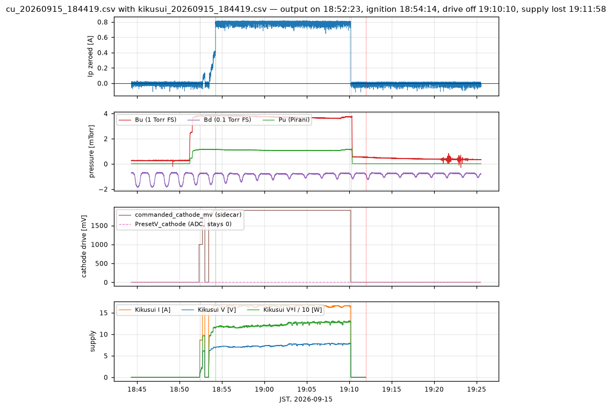
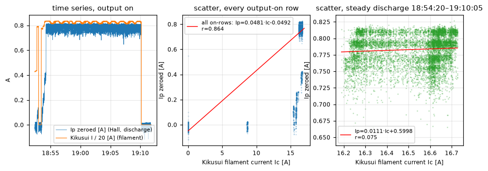
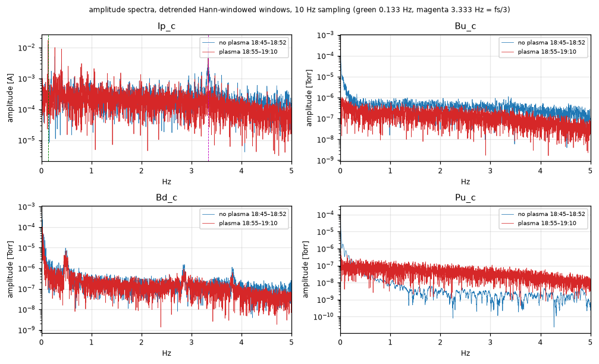
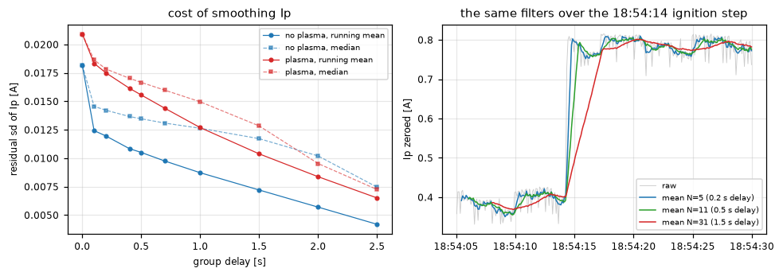
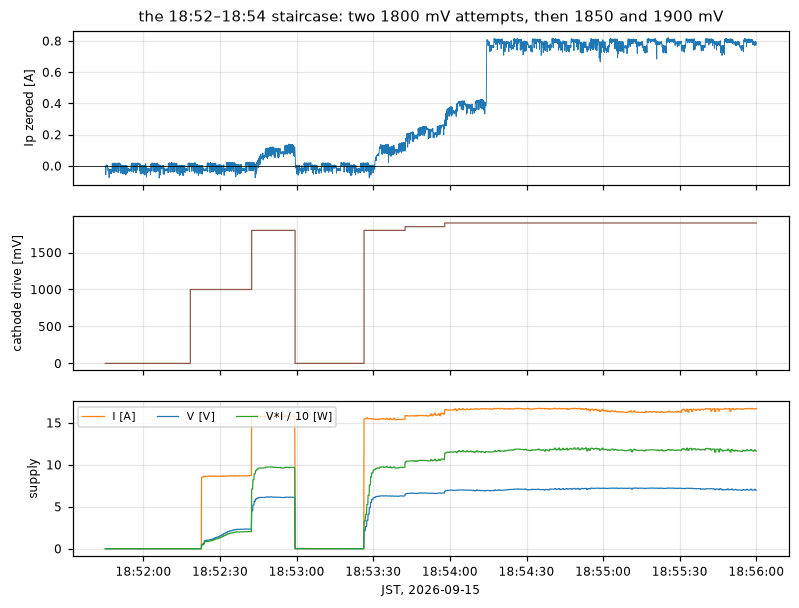
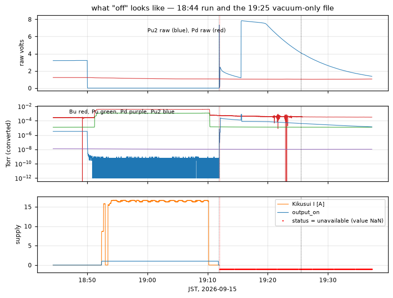

# September 15 plasma run, plasma current and channel noise

The evening produced one real discharge, 18:54:14 to 19:10:10, driven by hand
in millivolts with the Kikusui in current mode. This page compares the Hall
sensor against the supply, measures the noise on every analogue channel,
follows the ignition staircase, and records what each instrument reads once
it is switched off. All times are JST from the rig's own clock.

## Files analysed

Read-only copies in the repository's git-ignored `data/rig/2026-09-15/`.
Nothing on the rig was touched.

| File | Rows | Span | SHA-256 |
| --- | --- | --- | --- |
| `cu_20260915_184419.csv` | 24,708 | 18:44:19.339218–19:25:31.373103 | `252d1c1181e77f00fc1a9356cb313c90895a9d019aa984f2202cb5d45549ad26` |
| `kikusui_20260915_184419.csv` | 3,472 | 18:44:19.222562–19:25:28.223277 | `635b8b8471b2be285d4bc77ddaaeeb4114dedf5a1a1faf67f2937ed06c649e3b` |
| `cu_20260915_170626.csv` | 47,075 | 17:06:26.296854–18:24:56.336935 | `424309599a0b36c25127cfb7cef3db57a3fa65312dc64647fe19c9830f51dfdb` |
| `kikusui_20260915_170626.csv` | 9,400 | 17:06:26–18:24:56 | `bf7f4e881855d2687263683a74c493c9d704911272ef37cbc047b64acdfb880a` |
| `cu_20260915_161413.csv` | 1,828 | 16:14:13.901120–16:17:16.703378 | `3b6b9a2a88398d87c5a85fecd7ac81316cd4c03030e44eabac885051c4e87815` |
| `cu_20260915_192533.csv` | 214 | 19:25:34.162261–19:37:18.647529 | `48a5b439d2d3bd1dfaeac4e2b7bbaf427939ca630005a152e242ae396944f673` |
| `kikusui_20260915_192533.csv` | 142 | 19:25:35–19:37:15 | `e42bb0d271235b4a28cb9da4dd94879625e8774964c187690ae6a64c040092b7` |
| `controlunit.log` | 11,662 | 2023-06-02–2026-09-15 | `373d06b4d4742dc4a37d89482c3431c4e47ad2669b807434be2ee46856b677b3` |
| `controlunit.stderr.log` | 627 | — | `4be238de27068d4d348d7140b6a0251d3810993475497109ae586187067bd261` |

`cu_20260915_192533.csv` was still being written when it was copied.

## Plasma current against the supply

`Ip_c` is not zeroed in the file. The minute before the cathode drive rose,
18:51:18–18:52:18, gives median **-0.330102 A** over 600 rows (sd 0.024100 A).
That zero is stable: 18:44:20–18:52:00 gives -0.329719 A and 19:12:00–19:25:00,
long after everything was off, gives -0.334313 A. Every "zeroed" number below
subtracts -0.330102 A.

The 19:05 web reading reproduces from the files:

| Web UI, 19:05 | From the files | Source |
| --- | --- | --- |
| Ip 0.778 A zeroed | 0.7710 A (`Ip_c` 0.440906 less the baseline) | ADC, 19:05:00–19:05:10 medians |
| Bu 3.39e-3 Torr | 3.403e-3 Torr (`Bu_c` 3.6675e-3 less the 18:48:38 baseline 2.6415e-4) | ADC |
| Cathode V 7.792 V | 7.6057–7.8185 V over that 10 s | `kikusui_…184419.csv` |
| Cathode I 16.537 A | 16.2392–16.6089 A over that 10 s | `kikusui_…184419.csv` |

So the web's "Cathode V/I" is the Kikusui, and at 19:05 **the supply read
16.5 A, not 1 A**. The Kikusui current is the filament heating current; `Ip`
is the Hall sensor on the discharge path. They are different currents, and
the plot below compares them only to show that they are not coupled.

Nothing in these files holds a 1 A reading. The 2026-09-15 event log contains
no `plasma current N A` request, and `plasma_target_a` is `0.0` in all 3,472
sidecar rows, so it is not a PID target either. The most plausible reading of
the owner's "1 A by the PSU" is the front panel of the separate discharge
supply, which ControlUnit does not log at all. That cannot be confirmed from
the data; it can only be said that the 1 A is in no file, and that the
comparison the owner has in mind is between two instruments on the discharge
path of which only the Hall sensor is recorded.

A straight fit over every output-on row (n = 11,647) gives
`Ip = 0.04805·Ic - 0.04922`, r = 0.864. That correlation is entirely the
contrast between "supply off, no plasma" and "supply on, plasma running"; it
is not a transfer function. Inside the settled discharge, 18:54:20–19:10:05
(n = 9,546), the filament current moves over 16.189–16.727 A (sd 0.161 A) and
the fit collapses to `Ip = 0.00129·Ic + 0.76005`, **r = 0.006**. Over the same
window `Ip` zeroed is 0.7814 A mean, 0.7898 A median, sd 0.0349 A.

The relation is a threshold, not a scale or an offset. At 18:53:30 the filament
already carried 15.45 A at 6.28 V and `Ip` zeroed was 0.081 A. The per-minute
ratio `Ip/Ic` sits between 0.0473 and 0.0482 from 18:54 to 19:09, constant to
1 %, but only because both quantities are separately constant.

## Noise

Windows: **no plasma** 18:45:00–18:52:00 (4,200 samples) and **plasma**
18:55:00–19:10:00 (9,000 samples), both from `cu_20260915_184419.csv` at 10 Hz,
resampled onto an exact 0.1 s grid, detrended and Hann-windowed for the
spectra. `cu_20260915_161413.csv` (16:14:13–16:17:16, 1,828 rows) served as an
independent quiet check.

| Channel | Window | Mean | sd | sd / mean | sd after removing a 2 s running mean |
| --- | --- | --- | --- | --- | --- |
| `Ip_c` | no plasma | -0.33676 A | 0.01818 A | 5.40 % | 0.01498 A |
| `Ip_c` | plasma | 0.45324 A | 0.02093 A | 4.62 % | 0.01427 A |
| `Bu_c` | no plasma | 5.997e-4 Torr | 9.553e-4 Torr | (gas rising) | 1.218e-5 Torr |
| `Bu_c` | plasma | 3.7207e-3 Torr | 6.714e-5 Torr | 1.80 % | 6.592e-6 Torr |
| `Bd_c` | no plasma | -1.0815e-3 Torr | 4.348e-4 Torr | 40.2 % | 1.795e-5 Torr |
| `Bd_c` | plasma | -8.7228e-4 Torr | 1.706e-4 Torr | 19.6 % | 1.574e-5 Torr |
| `Pu_c` | no plasma | 1.0139e-4 Torr | 2.720e-4 Torr | (gas rising) | 3.197e-6 Torr |
| `Pu_c` | plasma | 1.0875e-3 Torr | 2.086e-5 Torr | 1.92 % | 2.317e-6 Torr |

The plasma adds almost nothing to the noise on `Ip`: 0.0182 A with no plasma,
0.0209 A with 0.79 A flowing, 0.0196 A after everything was switched off
(19:12:30–19:25:00), 0.0224 A in the unrelated 16:14 file. Roughly 2 % of the
discharge current, and it is instrument noise, not discharge fluctuation.

Autocorrelation of the detrended series, lags 1 to 10:

| Series | 1 | 2 | 3 | 4 | 5 | 6 | 7 | 8 | 9 | 10 |
| --- | --- | --- | --- | --- | --- | --- | --- | --- | --- | --- |
| `Ip_c`, no plasma | 0.221 | 0.151 | **0.716** | 0.110 | 0.067 | **0.604** | 0.022 | -0.011 | **0.516** | -0.036 |
| `Ip_c`, plasma | 0.684 | 0.572 | 0.638 | 0.460 | 0.399 | 0.449 | 0.284 | 0.236 | 0.284 | 0.136 |
| `Ip_c`, 16:14 file | -0.002 | -0.027 | **0.729** | -0.058 | -0.082 | **0.647** | -0.110 | -0.125 | **0.602** | -0.150 |
| `Bu_c`, plasma | 0.961 | 0.945 | 0.946 | 0.945 | 0.943 | 0.943 | 0.940 | 0.940 | 0.939 | 0.938 |
| `Bd_c`, plasma | 0.998 | 0.996 | 0.995 | 0.993 | 0.990 | 0.987 | 0.985 | 0.983 | 0.980 | 0.980 |
| `Pu_c`, plasma | 0.992 | 0.986 | 0.985 | 0.984 | 0.984 | 0.983 | 0.983 | 0.983 | 0.982 | 0.982 |

Two lines stand out on `Ip_c`, and only on `Ip_c`.

- **0.1333 Hz**, a 7.5 s period, amplitude 0.0127 A with no plasma and 0.0176 A
  during the discharge, with harmonics at 0.267 Hz (0.0101 A) and 0.400 Hz
  (0.0090 A). It is present before ignition, during the discharge, after the
  cathode drive was off, and in the 16:14 file recorded before the Kikusui was
  even configured. It is not the plasma and it is not the telemetry poll.
- **3.3333 Hz**, exactly one third of the 10 Hz sampling rate, amplitude
  0.0076 A with no plasma, 0.0027 A during the discharge, and 0.0198 A in the
  16:14 file. The lag-3, lag-6 and lag-9 autocorrelations above are its
  signature, with lags 1 and 2 near zero. Landing on `fs/3` makes an
  acquisition artefact more likely than a physical 3.33 Hz oscillation, but
  the files cannot settle that; it needs a run at a different sampling rate.

No mains-related line was found. At 10 Hz both 50 and 60 Hz alias to DC and
would appear only as a shifted baseline, which is consistent with the stable
-0.330 A zero.

`Bd_c` carries a periodic wander at **0.00917 Hz (109 s)** with a harmonic at
0.0179 Hz (56 s), amplitude 1.47e-4 Torr, peak-to-peak 1.198e-3 Torr over
18:45–19:25. It is on the channel with the plasma on and off. A heated
Baratron head's temperature controller would produce something like this;
that is a hypothesis, not a finding. `Bu_c` and `Pu_c` are quiet above
0.5 Hz, with median amplitudes of 1.1e-7 and 3.3e-8 Torr respectively during
the discharge.

### Filters

Measured on the same two windows. Group delay of a causal boxcar of length
N is (N-1)/2 samples.

| Filter on `Ip_c` | Delay | sd, no plasma | sd, plasma | 0.133 Hz line left | 3.333 Hz line left |
| --- | --- | --- | --- | --- | --- |
| none | 0 | 0.0182 A | 0.0209 A | 0.0176 A | 0.0027 A |
| boxcar N=3 | 0.10 s | 0.0124 A | 0.0183 A | 0.0176 A | **0.00000 A** |
| boxcar N=5 | 0.20 s | 0.0120 A | 0.0175 A | 0.0175 A | 0.0005 A |
| boxcar N=11 | 0.50 s | 0.0105 A | 0.0156 A | 0.0170 A | 0.0003 A |
| boxcar N=21 | 1.00 s | 0.0087 A | 0.0127 A | 0.0154 A | 0.0000 A |
| boxcar N=75 | 3.70 s | 0.0019 A | 0.0037 A | **0.0000 A** | 0.0000 A |
| 1-pole, tau 0.5 s | — | 0.0100 A | 0.0148 A | 0.0163 A | 0.0009 A |
| 1-pole, tau 1.0 s | — | 0.0079 A | 0.0117 A | 0.0136 A | 0.0004 A |
| median N=3 | 0.10 s | 0.0146 A | 0.0187 A | — | 0.0005 A |

Per channel, at least cost in delay:

- **`Ip`** — a 3-sample boxcar costs 0.1 s and puts an exact zero on the
  `fs/3` line; a 3-sample median does not (0.0005 A left) and smooths worse
  (0.0187 A against 0.0183 A). For a displayed or control value, cascade it
  with a 21-sample boxcar: 1.0 s total delay for 0.0127 A, 1.6 % of a 0.79 A
  discharge. Where a settled number matters more than latency, a 75-sample
  boxcar is exactly one period of the 7.5 s wander and nulls it outright:
  0.0037 A at 3.7 s delay, a factor 5.7 better than raw. Nothing between
  N=21 and N=75 helps much, because what remains is that one line.
- **`Bu`, `Pu`** — already quiet. Removing a 2 s running mean leaves
  6.6e-6 Torr on Bu and 2.3e-6 Torr on Pu, so a 1 s boxcar (N=11, 0.5 s
  delay) is enough and further smoothing only buys drift. Their whole-window
  sd is real pressure change, not noise: lag-1 autocorrelation 0.96 and 0.99.
- **`Bd`** — filtering is the wrong tool. Its sd is the 109 s wander plus a
  standing offset of about -0.8 mTorr; no filter short enough to be useful
  touches a 109 s period. Null the offset and find the source first.
- **`Pd`, `Pu2`** — see below; on this evening neither was a live measurement
  for most of the run, so no filter recommendation is meaningful.

## Cathode drive, gas and the staircase

**`PresetV_cathode` is 0 in all 24,708 rows**, as on 2026-09-14. The manual
drive is carried only by `commanded_cathode_mv` in the Kikusui sidecar, which
agrees with the event log exactly: 1000 mV at 18:52:18, 1800 mV at 18:52:42,
off at 18:52:59, 1800 mV at 18:53:26, 1850 mV at 18:53:42, 1900 mV at
18:53:58, off at 19:10:10.

**`PresetV_mfc1` and `PresetV_mfc2` are 0.0 in all 24,708 rows** too. The gas
was opened outside ControlUnit: `Bu_c` rose from 2.641e-4 to 3.798e-3 Torr and
`Pu_c` from 1.229e-5 to 1.141e-3 Torr between 18:50 and 18:52, with no MFC
command in the log. It was closed at 19:10:16–19:10:20, six seconds after the
cathode drive went off: `Bu_c` 3.744e-3 to 7.255e-4 Torr and `Pu_c` 1.184e-3
to 1.476e-5 Torr inside one 5 s bin.

5 s medians. `Ip` is zeroed; V, I and P are the Kikusui.

| Time | drive | Ip | Ic | V | V·I | Bu |
| --- | --- | --- | --- | --- | --- | --- |
| 18:52:20 | 1000 mV | -0.006 A | 0.011 A | -0.005 V | 0.0 W | 3.798e-3 Torr |
| 18:52:25 | 1000 mV | 0.007 A | 8.647 A | 1.210 V | 10.5 W | 3.805e-3 Torr |
| 18:52:35 | 1000 mV | -0.016 A | 8.669 A | 2.311 V | 20.1 W | 3.817e-3 Torr |
| 18:52:40 | 1800 mV | 0.017 A | 15.744 A | 4.507 V | 71.1 W | 3.821e-3 Torr |
| 18:52:50 | 1800 mV | 0.101 A | 15.788 A | 6.128 V | 96.8 W | 3.790e-3 Torr |
| 18:52:55 | 1800 mV | 0.122 A | 15.777 A | 6.125 V | 96.9 W | 3.786e-3 Torr |
| 18:53:00 | off | 0.000 A | 0.019 A | -0.001 V | 0.0 W | 3.817e-3 Torr |
| 18:53:25 | 1800 mV | 0.004 A | 15.470 A | 3.379 V | 52.7 W | 3.828e-3 Torr |
| 18:53:35 | 1800 mV | 0.104 A | 15.401 A | 6.264 V | 96.7 W | 3.815e-3 Torr |
| 18:53:40 | 1850 mV | 0.149 A | 15.813 A | 6.508 V | 103.2 W | 3.817e-3 Torr |
| 18:53:55 | 1850 mV | 0.260 A | 16.136 A | 6.634 V | 106.8 W | 3.817e-3 Torr |
| 18:54:00 | 1900 mV | 0.377 A | 16.577 A | 6.982 V | 115.6 W | 3.819e-3 Torr |
| 18:54:10 | 1900 mV | 0.415 A | 16.653 A | 6.929 V | 115.5 W | 3.817e-3 Torr |
| 18:54:15 | 1900 mV | 0.791 A | 16.670 A | 6.944 V | 115.7 W | 3.828e-3 Torr |
| 18:55:00 | 1900 mV | 0.789 A | 16.416 A | 7.199 V | 118.2 W | 3.828e-3 Torr |

`Ip` followed filament **power**, not the DAC command and not the gas. From
97 W to 116 W, a 20 % rise in power, took `Ip` from 0.10 A to 0.79 A, a factor
of eight. `Bu` moved by 0.7 % across the whole staircase, from 3.798e-3 to
3.828e-3 Torr, so the gas explains none of it.

Ignition itself took two samples. The last pre-ignition row is 18:54:14.252300
at 0.4039 A; 18:54:14.355946 reads 0.7293 A and 18:54:14.455239 reads 0.7997 A.
The cathode drive had been at 1900 mV for 16 s by then and did not change.

After ignition the discharge was insensitive to further filament heating. With
the drive held at 1900 mV, the Kikusui voltage drifted from 6.93 V to 7.79 V
and the power from 115.5 W to 128.6 W, +11 %, as V/I rose from 0.4254 Ω at
18:54:20 to 0.4656 Ω at 19:09 — the filament warming through. `Ip` over the
same fifteen minutes went from 0.790 A to 0.786 A.

For a cold baseline: during 17:25–17:37 in the earlier run the drive sat at
599 mV, giving 1.0699 V, 5.0862 A, 0.2100 Ω and 5.385 W. Hot-to-cold
resistance ratio 2.2. That stretch had no gas (`Bu_c` 2.79e-4 Torr) and `Ip_c`
never left its baseline, so 17:06–18:24 was a filament conditioning, not a
plasma attempt.

## What "off" looks like

**Kikusui.** The drive went to 0 mV at 19:10:10 and the supply's own output
stayed enabled for another 98 s: from 19:10:11 to 19:11:47 `output_on` is 1
with `voltage_v` -0.0053 to -0.0060 V and `current_a` 0.0083 to 0.0090 A. At
**19:11:48.076632** `output_on` becomes 0 with the same V and I. At
**19:11:58.086334** the supply loses power and every remaining row reads
`status=unavailable`, `error=timed out`, `query_ms` about 1001 ms, and empty
`voltage_v`, `current_a`, `output_on` and `identity` — 163 such rows to
19:25:28.223277, retried every 5 s, matching `Kikusui telemetry LOST` in the
log at 19:11:58. All 142 rows of `kikusui_20260915_192533.csv` are the same.
While powered the link was excellent: 3,309 ok rows, `query_ms` median 4.80,
p99 25.85, max 48.51.

That is the one instrument that self-reports. The analogue channels do not.

**Ion gauges.** `Pu2`'s controller was switched off at about 18:49:55: its raw
voltage fell from 3.212 V to 0.0041 V within five seconds and settled at
0.00031–0.00092 V, which at range -6 converts to `Pu2_c` = 3.06e-10 Torr — a
perfectly plausible-looking ultra-high vacuum. It was switched back on at
19:12:06.984792 (raw 1.93 V), with the range moved -6 to -5 to -4 inside
0.2 s and back to -5 at 19:15:39.809981.

`Pd` is the harder case. Its raw voltage ran from 1.236 V at 18:44 down to
1.0385 V at 19:25 and 1.0565 V at 19:37, drifting monotonically and **never
responding to the gas that moved `Pu` by 1.17 V and `Bu` by 35.6 mV**. At
range -8 that converts to 1.04e-8 to 1.24e-8 Torr for the whole evening. It
looks like a clean base-pressure reading and it is not a measurement of a
chamber that was at 3.8e-3 Torr.

**Baratrons.** Both controllers stayed on. `Bu` tracked the gas correctly.
`Bd` sat at -8.7e-4 Torr throughout, a negative pressure, that is, a standing
zero offset of about -0.8 mTorr on a 0.1 Torr head, and it did not respond to
the gas either.

**The 19:25 vacuum-only file**, 19:26:00–19:37:18 medians: `Ip_c` -0.32230 A,
`Bu_c` 3.1832e-4 Torr, `Bd_c` -7.4774e-4 Torr, `Pu_c` 1.2323e-5 Torr, `Pd_c`
1.0374e-8 Torr, `Pu2_c` 2.2194e-5 Torr.

The consequence for a future "instrument off" flag: **no converted value from
an off instrument looks invalid**, and the off signatures differ between
instruments — `Pu2` off is under 0.01 V, `Pd` off is 1.0 to 1.2 V and
drifting, `Bd` off (if it is off) is -0.08 V. A single voltage threshold
cannot carry the flag. It has to be operator-set in the UI or read from the
controller, and the file schema needs somewhere to record it, exactly as
`status` does for the Kikusui.

## Timing and other findings

- **The 18:44 run kept cadence.** 24,708 rows, median interval 0.099950 s,
  mean 0.100050 s, p99 0.1213 s. Exactly one interval above 0.3 s:
  **0.347 s at 19:05:09.043266**. Nothing in the log at that time.
- **The 17:06 run had one real fault.** 47,075 rows, one interval above 0.3 s:
  **0.712 s at 17:57:01.831070**, matching the logged
  `TimeoutError('ADS1115 at 0x49 never finished a conversion')` at 17:57:01,
  recovered after one failed read. Different from the two
  `OSError(121, Remote I/O error)` faults of 2026-09-14.
- **The 19:25 file's 69 gaps above 0.3 s are deliberate**: sampling was set to
  10 s at 19:25:48, so the file runs at 0.1 Hz from 19:25:58 onward.
- **No tracebacks.** `controlunit.stderr.log` contains zero occurrences of
  `Traceback`; its only 2026-09-15 content is six process-start markers, at
  16:14:01, 17:04:37, 18:29:50, 18:32:02, 18:35:49 and 18:42:54.
- **`Bu` went electrically noisy during shutdown**, 19:20:50–19:23:50: sd rose
  from 7.5e-6 to as much as 1.36e-4 Torr, with excursions to -2.87e-4 and
  +8.27e-4 Torr, that is, negative pressures. Nothing in the event log at
  those times; `Ip` and `Pu` were unaffected. Worth watching the next time
  instruments are switched off with acquisition running.
- **Nine ADC files for one day.** Four short files between 18:30 and 18:44
  came from repeated app restarts while the gauge ranges were being set. Each
  restart starts a new CSV and a new Kikusui sidecar.

## What the data cannot answer

The discharge supply is not logged, so the owner's 1 A cannot be checked
against the 0.78 A the Hall sensor recorded; that needs the second supply on
the record. Whether the 3.333 Hz line on `Ip` is an artefact of the read
schedule needs one quiet run at a different sampling rate. Whether `Pd` was
switched off or merely unresponsive, and what drives the 109 s cycle on `Bd`,
both need a deliberate check at the instruments.
