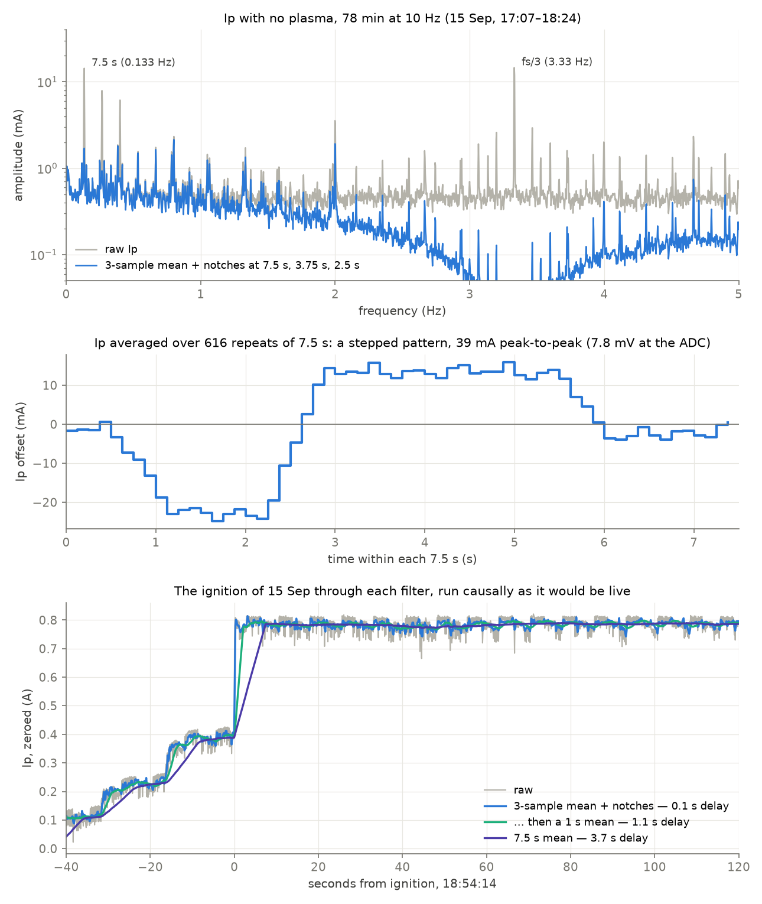

# Hall sensor noise, its zero, and the filter for Ip

A second, narrower look at the plasma current channel `Ip` in the
2026-09-15 files, done on 2026-09-19 to choose a frequency filter. The
September 15 page ([plasma run and noise](2026-09-15-plasma-run-and-noise.md))
found the two lines on `Ip`; this page finds where they come from in time,
why the zero is always negative, and which filter removes the most for the
least delay. The 2026-09-18 run was meant to be analysed too, but its files
had not reached `data/rig/` when this was written; everything here is
September 15.

## Files analysed

Read-only, from the git-ignored `data/rig/2026-09-15/`; checksums are in the
September 15 page.

- `cu_20260915_170626.csv`, 17:07–18:24: 78 minutes of `Ip` with no gas and
  no plasma (a filament conditioning), the long quiet record the spectra
  are taken from.
- `cu_20260915_184419.csv`: 18:45–18:52 before the gas, 18:55–19:10 the
  settled discharge, and the ignition at 18:54:14.
- `cu_20260915_161413.csv` and `cu_20260915_192533.csv` for the zero.

The ADC's real cadence in these files is 9.995 Hz (mean interval
0.10005 s), and that is the rate every frequency below is computed with.

## What the noise is made of

Raw `Ip` scatters by 23 mA (standard deviation after removing drifts slower
than two minutes). Most of that is two regular patterns, not randomness.

**Every third sample.** Folding the 78-minute record on the sample number
modulo 3 gives −2.49, +0.21 and +2.29 mV at the ADC, about ±12 mA. The line
sits at 3.3317 Hz, which is a third of the real 9.995 Hz cadence and not a
third of 10 Hz: it follows the sample count, not the clock. The ADC
worker hands its rows to the main thread in batches of three
(`STEP = 3` in `controlunit/devices/device.py`), so the main thread's work
comes around every third sample. The same fold on every other channel gives
at most 37 µV and mostly under 7 µV: the pattern is on `Ip` alone.

**Every 7.5 seconds.** The line measures 0.13334 Hz with 0.00022 Hz
resolution, which is 7.500 s of clock time, and carries harmonics at 0.267 Hz
(8.0 mA) and 0.400 Hz (5.3 mA) beside its 15.7 mA fundamental. Folded on
clock time it is a stepped pattern, 39 mA peak to peak (7.8 mV at the ADC):
about 1.5 s low, 3 s high, 2 s near the middle (middle panel above). The
first and second halves of the 78 minutes give the same profile
(correlation 0.998), so it is stable for over an hour. The other channels
carry faint copies of 10 to 390 µV, twenty to eight hundred times smaller.
Nothing in ControlUnit runs on a 7.5 s timer that this search found.

**The rest** is broadband, about 8 mA once both patterns are removed, with
small lines of its own (2.0 Hz, 2.7 mA, among them).

## Why the zero is always negative

The conversion is `5 * (v - 2.52)`: 5 A per volt about a fixed 2.52 V. The
sensor's output with no current is lower than that every time:

| Stretch | `Ip_c` | Raw voltage | Twice the raw voltage |
| --- | --- | --- | --- |
| 16:14 file | −0.3305 A | 2.4539 V | 4.908 V |
| 17:06 file, start | −0.3473 A | 2.4505 V | 4.901 V |
| 17:06 file, end | −0.3420 A | 2.4516 V | 4.903 V |
| 18:45 before the gas | −0.3305 A | 2.4539 V | 4.908 V |
| 19:15 after the run | −0.3343 A | 2.4531 V | 4.906 V |
| 19:26 vacuum only | −0.3223 A | 2.4555 V | 4.911 V |

Both Hall sensors the lab documents (the ACS712 and the WCS1800 in the
explainers' `docs/hardware/sensors/`) are ratiometric: with no current the
output is half the sensor's own supply, and the sensitivity scales with the
supply too. The sensor is powered from the Raspberry Pi's 5 V pin, and a
Pi's 5 V pin under load commonly reads about 4.9 V. Half of 4.90–4.91 V is
exactly the zero measured. The fixed 2.52 V would be right for a 5.04 V
supply.

The same mechanism explains why the two patterns are on `Ip` alone: it is
the only channel whose instrument runs from the Pi's own supply. Whatever
makes the Pi draw more current — the main thread waking for a batch every
third sample, and something on a 7.5 s cycle — sags that supply, and the
sensor's zero moves with half of it. The ±2.4 mV and 7.8 mV peak-to-peak
patterns correspond to ±5 mV and 16 mV on the supply. This is a hypothesis
the files are consistent with, not a measurement; the supply itself was not
recorded. (The 2026-09-09 finding that "Pi's own power was clean" was about
the Pi's undervoltage flags; 4.9 V is well above that threshold and still
moves the Hall zero by millivolts.)

The negative zero does not affect the zeroed reading, which subtracts it.
It does make the zero wander: 30 mA across the evening here, which is 6 mV
at the sensor, 12 mV of supply.

### The zero button's two seconds

The baseline behind "Zero now" and the Scales dock's zero button averages
the last `BASELINE_SECONDS = 2.0` (`controlunit/main.py`). Two seconds land
at a random point of the 7.5 s pattern. Measured over the 78 minutes, a
two-second zero is off by 10.9 mA (standard deviation), 31 mA at worst. A
7.5 s zero is off by 1.8 mA, 9 mA at worst; 15 s, by 1.5 mA and 6 mA.

## The absolute value

The zeroed current is `5 A/V × (v − zero)`, so its scale rests entirely on
the 5 A per volt, which is 200 mV/A. That matches none of the documented
sensors: the ACS712-05B is 185 mV/A (the 20 A part 100, the 30 A part 66)
and the WCS1800 72 mV/A. If the sensor is an ACS712-05B, every current
ControlUnit shows is 8 % low, and the 0.78 A plasma of September 15 was
0.84 A; on a 4.91 V supply the sensor's own sensitivity is a further 2 %
lower. Neither closes the gap to the 1 A queezz read on the discharge
supply's panel. Only a calibration with a known current settles it (below).

## Filters

Each filter was run causally, on past samples only, as it would run live.
Noise is the standard deviation after removing drifts slower than two
minutes; delay is the time for the filtered value to cover half of a step.
The discharge was 0.79 A.

| Filter on `Ip` | No plasma, 78 min | No plasma, 18:45 | Plasma, 18:55 | Delay |
| --- | --- | --- | --- | --- |
| none | 22.9 mA | 22.7 mA | 23.6 mA | — |
| 3-sample mean | 15.8 | 12.6 | 18.3 | 0.1 s |
| 0.5 Hz low-pass, Butterworth, 2nd order | 13.9 | 11.0 | 16.3 | 0.5 s |
| 3-sample mean, then a 1 s mean | 10.7 | 8.6 | 12.2 | 1.1 s |
| **3-sample mean and notches at 7.5, 3.75 and 2.5 s** | **9.0** | **7.9** | **10.0** | **0.1 s** |
| the same, then a 1 s mean | 3.6 | 4.0 | 4.3 | 1.1 s |
| 7.5 s mean | 1.8 | 1.3 | 2.2 | 3.7 s |

A low-pass is the wrong tool here: the largest component is at 0.133 Hz,
inside the band the plasma current itself moves in, and a low-pass that
removed it would cost seconds. The 3-sample mean puts an exact zero on the
every-third-sample pattern. The notches are second-order IIR notches (a
band-stop a few thousandths of a hertz wide) at 1/7.5 s and its second and
third harmonics, with Q = 100. The 7.5 s mean is one period of the pattern
and nulls it and every harmonic outright, the every-third-sample pattern
included, since 75 is a multiple of 3.

The notches' cost is a small ring after a step: a 0.4 A step leaves 10 mA,
6 mA of it still there after 60 s, below the noise that remains. The
choice of Q and of the number of harmonics:

| Notches | Noise, no plasma | Noise, plasma | Ring after a 0.4 A step |
| --- | --- | --- | --- |
| 1 harmonic, Q 100 | 11.5 mA | 13.8 mA | 4 mA |
| 2 harmonics, Q 100 | 10.0 | 11.8 | 7 |
| 3 harmonics, Q 100 | 9.0 | 10.1 | 10 |
| 6 harmonics, Q 100 | 8.6 | 9.6 | 17 |
| 10 harmonics, Q 100 | 8.4 | 9.3 | 26 |
| 3 harmonics, Q 30 | 8.7 | 9.5 | 31 |
| 3 harmonics, Q 300 | 9.5 | 11.9 | 3 |

Past three harmonics the noise hardly falls and the ring keeps growing,
because what remains is the broadband part. A running template of the 7.5 s
pattern, subtracted phase by phase, did no better (8.5 mA) than three
notches. The ignition in the bottom panel stays a two-sample jump through
the 3-sample mean and notches.

For the three uses:

- **Live value and PID**: the 3-sample mean and three notches. 23 to 9 mA,
  0.1 s.
- **Display**: the same and a 1 s mean. About 4 mA, 1.1 s.
- **A settled number**, a report, a zero: a 7.5 s mean. About 2 mA, 3.7 s.

The notches are designed for the actual sampling period, and must be
redesigned whenever it changes; the file keeps the raw readings.

## What the hardware can change

The two patterns are the Pi's load reaching the sensor, through its
supply or its ground, if the hypothesis holds, and no filter on the signal
wire removes that. Amended the same day with the boards' own files and
queezz's corrections: the ADC board has pads for the RC and the surge
diodes, the breakout has a ground, and the sensor should take its ground
from the ADC side, star-like.

Where things are, from the two boards' own files. The ADC board is the
Y2 Corporation AIO-32/0RA-IRC (schematic in the explainers,
`docs/assets/y-corp-adc-schematic.pdf`); the panel between it and the rig
is the lab's own breakout, `panel-bncs` in `queezz/controlunig-pcb`.

- Every ADC input passes a 39 kΩ / 10 kΩ divider on the ADC board (the
  4.9 in the code's volts) and is read against the board's analogue ground
  `AG`, which joins the Pi's ground through one ferrite (L2). `AG` reaches
  the breakout on ribbon pins 33–34: the breakout's ground is `AG`.
- At each divider's midpoint the ADC board has an unfitted capacitor pad
  to `AG` and an unfitted dual clamp diode to `AG` and 3.3 V. Channel 0,
  `Ip`: R1 (39 kΩ), R33 (10 kΩ), **C1**, **D1**. Channel 1: R3, R35,
  **C3**, **D3**. Do not fit the pads after the multiplexers (C41, C42):
  those are shared by sixteen channels each and would carry one channel's
  voltage into the next.
- On the breakout, the lower terminal block carries channels 0–7, the
  upper 8–15, and the BNCs the even channels 16–30 (channel 18 free) with
  pads for a ferrite, a capacitor and a surge diode, none of them fitted
  (queezz: "Those pads are pads, not populated"). In the board file the
  ferrite pad sits in series between the BNC's centre pin and the channel,
  so a BNC that reads must have that pad bridged; a ferrite bead replaces
  the bridge. The odd channels 17–31 are not brought out.

1. **Record the sensor's supply.** One wire from the sensor's own 5 V pin
   to **channel 1**, the lower terminal block's "1", beside `Ip`'s "0"
   (owner's choice of channel 2026-09-19). The input takes 0–10 V, so it
   goes straight in. If that channel shows the two patterns, the Pi's load
   reaches the sensor, and the reading can be made ratiometric in
   software: current from `v_out / v_supply`, which cancels the supply's
   movement and the negative zero with it.
2. **Ground the sensor on the ADC side.** The sensor's ground now comes
   from the Pi. Take it from the breakout's ground instead, which is `AG`,
   the node every channel is measured against, so that none of the Pi's
   own return current flows between the sensor's ground and the ADC's.
   That is the second route by which the Pi's load can reach `Ip`, besides
   the supply sagging, and the ratio in step 1 cancels only half of a
   ground shift. The ADC board already joins `AG` to the Pi at one point
   (L2); nothing on the sensor's side should make a second joint.
3. **Power the sensor from its own supply.** Powering it from the Mean Well
   directly, on its own pair of wires, removes the drop in the Pi's cable
   and fuse that moves with the Pi's load; the Mean Well's own output still
   moves somewhat with everything else it feeds, and carries switching
   ripple. A small linear regulator of its own (a 7805 or a low-noise LDO,
   fed from a 12 or 24 V rail if the rack has one) is quieter still. Its
   minus joins at the breakout's ground and nowhere else.
4. **The RC is on the ADC board already, less the capacitor.** The 39 kΩ
   series resistor and the 10 kΩ to ground look like 7.96 kΩ to a capacitor
   at the midpoint, so C1 alone makes the RC: **2.2 µF** gives a 9 Hz
   corner and 17.5 ms, a step settled to 0.3 % within one 100 ms sample
   (1 µF: 20 Hz, 8 ms). Ceramic, X7R, 6.3 V or more; the midpoint never
   sees more than about 2 V. It stops noise between 5 Hz and a few hundred
   hertz from folding down into the samples, which is what most of the
   remaining broadband 8 mA probably is, and adds no error, since there is
   no extra resistor. Fit the **same value on C3**, so the supply channel
   is filtered exactly like `Ip` and the ratio stays exact.
5. **Clamp diodes, if fitted, silicon.** D1's pads take a SOT-23 series
   pair. A BAV99 (silicon) fits; a BAT54S (Schottky) fits too but leaks
   more, and a leak through the 8 kΩ midpoint is an offset, of millivolts
   at the input once warm. For the sensor inside the rack the clamp is
   optional; the gauges' long BNC cables are where it matters.
6. **Ferrites and decoupling.** Ferrite beads on the breakout's FB1–FB8
   pads when they arrive, a clip-on ferrite on the sensor cable, and
   100 nF with 10 µF across the sensor's supply pins at the sensor. These
   treat radio-frequency pickup from the discharge, arcs and switching
   supplies, not the two slow patterns.

In that order, with ten quiet minutes at 10 Hz after step 1 so the cause
is seen before it is removed; then:

7. **Calibrate with a known current.** With the discharge off, a bench
   supply in constant-current mode (or any supply, a power resistor and a
   multimeter in series as the reference) through the sensor, at 0, ±0.5,
   ±1 and ±2 A, 30 s each at 10 Hz, with the zero taken again at the end.
   With the supply recorded, fit `v_out / v_supply` against the current:
   the slope is the sensitivity and the intercept the zero, the two numbers
   the conversion needs. A sensor with a through hole (the WCS1800) can
   take N turns of wire to multiply a small current.

After the hardware change, ten quiet minutes at 10 Hz show which patterns
survive; the filter is then built for what is left.

## What the data cannot answer

Whether the supply is the cause, until it is recorded; what runs every
7.5 s; which sensor is fitted and its true sensitivity; and whether the
2026-09-18 run shows the same patterns, until its files arrive.
