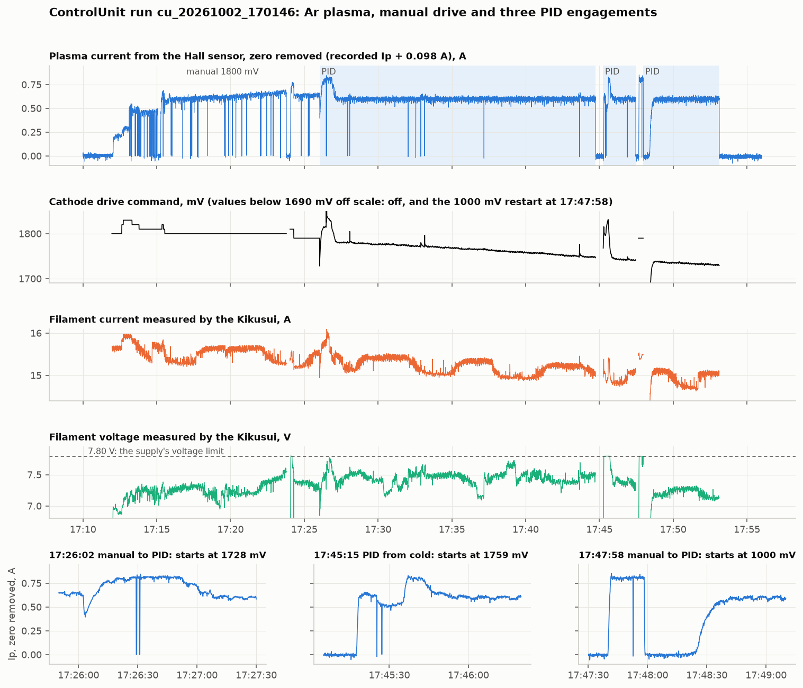

# October 2 argon plasma: the PID's first real run, and a two-day hang

Queezz ran an argon discharge on 2026-10-02 to measure electrode voltages
against his PIC simulations and to try the plasma-current PID. This page
reads the rig's files for that run: why the program hung before it, what
the Hall sensor's current means against the discharge supplies, how the
PID behaved at each of its three engagements, and a 7.5 s ripple that
turns out to be in the cathode drive itself. All times are JST from the
rig's own clock. The journal for the day is the vault's
`Journal/2026/10/2026-10-02.md`.

## Files analysed

Read-only copies in the repository's git-ignored `data/rig/2026-10-02/`,
with the analysis scripts beside them in `analysis/`. Nothing on the rig
was touched; it was recording a slow 10 s run at the time and was left
alone.

| File | Rows | Span | SHA-256 |
| --- | --- | --- | --- |
| `cu_20261002_170146.csv` | 38,168 | 17:01:46.841661–18:05:27.702412 | `946227a861742ce8fa072dc6001e7b207fe3e83ef36c8d0165e63c0902a57a8d` |
| `kikusui_20261002_170146.csv` | 6,674 | 17:01:46–18:05:26 | `a69162dbb7c241331dcebe9f8050cf02b26d66613a1226e1c666dae16bca0a82` |
| `cu_20261002_170125.csv` | 191 | 17:01:25–17:01:44 | `70e7aae2a3bea131d274a26b2b1935a8e21dd0ae2b32ac01501803c000846c62` |
| `kikusui_20261002_170125.csv` | — | the same 19 s | `ab29b636081d3e4ce9e2321771e89766df4de481c5f3205bd1fbb72d57f492e3` |
| `controlunit-2026-10-02.log` | 3,239 | the day's lines of `controlunit.log` | — |

The checksums were taken on the rig and again on the copy and agree. The
sampling was sound: 0.1001 s mean interval, one gap of 0.62 s at 17:27:05
(a logged I²C retry), three intervals above 0.3 s.

## The hang at 17:00 was the two-day run choking the main thread

The program killed over VNC at 17:00 had been started on 2026-09-30 at
17:04 and left recording at 0.1 s. Its own timing lines tell the story.
Each delivery of three samples costs an append and a redraw, and both
grow with the length of the run, because the whole run is held in memory
and copied at every step:

| When | Append | Redraw | Total per delivery | Behind real time |
| --- | --- | --- | --- | --- |
| 09-30 17:05 | 4 ms | 21 ms | 27 ms | 0 |
| 09-30 20:00 | 109 ms | 125 ms | 237 ms | 0 |
| 10-01 00:00 | 218 ms | 240 ms | 464 ms | 24 min |
| 10-01 09:00 | 353 ms | 384 ms | 741 ms | 4.4 h |
| 10-01 17:00 | 447 ms | 505 ms | 959 ms | 9.1 h |
| 10-02 16:00 | 627 ms | 659 ms | 1289 ms | 24.7 h |

A delivery arrives every 0.3 s. Once one costs more than that, some time
between 20:00 and midnight on the first evening, the main thread never
catches up: it spends all its time on the backlog, so the window stops
answering and so does the web view, which reads what the main thread
writes. By the kill the backlog was 25.4 hours.

The file shows the same thing from the other side. Its last row is
2026-10-01 15:34:30, and the process was killed at 2026-10-02 17:00: the
samples in between were read from the ADC and were waiting in memory to
be written, and were lost with the process. `cu_20260930_170412.csv` is
683,898 rows and 360 MB and ends 25 hours early.

This is the item `directions.md` has carried since 2026-09-04 ("the whole
run is held in memory and copied every step") and again since 4.13.0
("unbounded history"). It was harmless at 10 s sampling and is fatal at
0.1 s within about four hours. The same growth is visible in today's
one-hour run: the append went from 4 ms to 20 ms and the redraw from 21
to 60 ms in the first 26 minutes.

## The current: 0.1 A of the gap is the zero, the rest is the scale

The PID held the *readout* at 0.50 A from 17:27 to 17:53. The Hall
sensor's zero was never taken that day (`zeros.Ip` is 0.0 in every
journal snapshot), and the readout with no discharge is not zero:

| Stretch | `Ip_c` | `Ip/Vhall` |
| --- | --- | --- |
| 17:02–17:11, supply off | −0.0977 A (sd 9.7 mA) | 0.49609 |
| 17:23:49–17:24:00, drive at 0 | −0.0962 A | |
| 17:44:50–17:45:14, PID off | −0.1010 A | |
| 17:54–18:05, after | −0.0993 A | 0.49603 |

So a readout of 0.50 A was a Hall current of 0.60 A, and the 0.70 A
setpoint at 17:26 was 0.80 A. The offset is the same −98 mA found on
2026-09-30 and it did not move by more than 4 mA across the run. It is
not noise and not the supply (the 4.22.0 correction divides by the
measured `Vhall`, 4.976 V all run, with no sag when the discharge lit):
it is the sensor resting at 49.6 % of its supply where the settings
assume 50.0 %, which is inside an ACS712's offset tolerance and inside
the difference between two ADC channels' dividers. `Zero Ratio: 0.4961`
in `settings.yml` would remove it for good; pressing Zero Ip before a
discharge removes it for a run. The PID does subtract the zero
(`plasma_current_converted - zero_ip`); it had none to subtract.

Against the discharge supplies, the journal's table at 17:38 gives
I_pl 0.7 A and I_pre 0.9 A while the Hall current, zero removed, was
0.60 A. What remains after the zero is a scale question, and it is the
one the 2026-09-19 page left open: the conversion's 5 A/V (200 mV/A) is
provisional and matches no sensor the lab documents. If the part is an
ACS712-05B (185 mV/A) the 0.60 A is 0.65 A; to read 0.70 A the sensor
would have to be 171 mV/A. On 2026-09-15 the same comparison was 0.78 A
against 1 A. Two things are needed to close it and neither is in a file:
which conductor the sensor is on (anode, preanode or the cathode return
— the two supplies read different currents, so they cannot both match),
and one calibration with a known current, the step still open from the
Hall rework.

## The PID: it regulates, and it starts wherever the clock left it

**Holding.** From 17:28 to 17:44 the loop held 0.5005 A mean with the
same sample noise as manual drive (15 mA, dropouts excluded). To do it,
it walked the cathode command down from 1780 mV to 1748 mV, and to
1733 mV by 17:53, as the source warmed: filament power fell from 114 W
to 107 W at constant plasma current. Under a fixed manual drive the
current is not constant: 1790 mV gave a readout of 0.53 A at 17:25 and
0.71 A at 17:47. That drift is what the loop removed.

**Arcs.** Dropouts, where Ip falls to its zero for 0.2–0.3 s, came 20
times in the seven manual minutes at 1800 mV (2.8 per minute) and 8
times in the first seventeen PID minutes (0.46 per minute: 5, 2, 1 in
successive thirds), then one in the second PID stretch and none in the
last 3.6 minutes. The journal's
"fewer arcing" is in the data. It cannot be credited to the loop alone:
the rate was already falling with time as the source conditioned, and
the PID stretch is simply later.

**Engaging.** The first command after each engagement was different
every time, and none was the drive already held:

| Engaged | From | Error at engage | First command | What followed |
| --- | --- | --- | --- | --- |
| 17:26:02, 0.70 A | manual 1790 mV, 105 s | +0.17 A | 1728 mV | sag to 0.30 A, 20 s climb |
| 17:45:15, 0.50 A | PID off, 31 s | +0.60 A | 1759 mV | lit in 3 s, overshoot to 0.70 A |
| 17:47:58, 0.50 A | manual 1790 mV, 20 s | −0.21 A | 1000 mV | plasma out for 26 s, relit by the ramp |

All three follow from one line of arithmetic. The loop is almost purely
integral (P = 30 mV/A, I = 40 mV/A·s, on a 1000 mV base), and its clock
is reset when a manual value is set or the PID is turned off, not when
it is engaged. Its first step therefore integrates the error over the
whole time since then: 1000 + 40 × error × seconds. That gives
1000 + 40 × 0.17 × 105 = 1723 mV, 1000 + 40 × 0.60 × 31 = 1762 mV, and
1000 + 40 × (−0.21) × 20 clamped at 1000 mV — the three numbers in the
file. The first engagement landed near the held 1790 mV by luck; after
ten manual minutes at the same error it would have started at the
5500 mV ceiling. The third put the plasma out, which is the journal's
"manual to PID failed this time", and then relit it without overshoot
only because an integral starting from zero ramps at 24 mV/s.

This is the bumpless-pickup defect already in `directions.md` (preset
the integrator so the first command equals the held drive; start the
clock at engage), now with three measured cases to test against.

**A ceiling the loop cannot see.** The Kikusui's voltage limit is
7.80 V, and the filament reached it three times (17:24:05–10,
17:45:18–42, 17:47:41–57): the voltage sits flat at 7.797 V and the
current no longer follows the command. During the cold start the loop
raised its command from 1797 to 1831 mV with no effect while the
filament warmed at the limit, then overshot when the supply came back
into current mode. A loop that knows the supply is voltage-limited
should hold its integral there.

**The command is recorded.** `PresetV_cathode` carries the PID's
command at every sample, and the sidecar's `commanded_cathode_mv` the
same at 2 Hz; `/api/state` has it as `setpoints.cathode_mv`. It is not
shown on the Cathode card while the PID holds, which is what the journal
asked for at 17:47. In manual mode `PresetV_cathode` is still 0 (the
defect noted on 2026-09-15).

## The 7.5 s ripple is in the cathode drive, and the plasma follows it

The 0.1333 Hz line known since 2026-09-15 was read as the Hall sensor's
supply. With no discharge it is now small, 2.5 mA, which is what the
supply correction left. With the discharge on it is 13 mA in amplitude,
the same under manual drive and under the PID, and this time it is not
an artefact of the sensor:

| Stretch | `Ip` | Kikusui current | Kikusui voltage | `Vhall` |
| --- | --- | --- | --- | --- |
| No discharge, supply off | 2.6 mA | 0.03 mA | 0.03 mV | 1.4 mV |
| Manual 1800 mV | 13.5 mA | 22.6 mA | 10.9 mV | 1.4 mV |
| PID, 17:28–17:36 | 12.6 mA | 20.9 mA | 15.8 mV | 1.4 mV |
| PID, 17:49–17:53 | 13.2 mA | 19.3 mA | 17.5 mV | 1.5 mV |

Amplitudes of the best sinusoid between 0.125 and 0.142 Hz; every one
lands on 0.1333–0.1334 Hz. The supply's own measurement of the filament
current carries the line at 21 mA while the commanded value is constant,
and other frequencies in the same record sit at 5 mA. Folded on 7.50 s
the shape is a step, about 2.5 s low and 5 s high, 25 mA peak to peak in
the plasma current and 37 mA in the filament current.

So the filament current is really being modulated, by about 0.24 % peak
to peak, and the discharge current follows at about 0.6 A per ampere of
filament current.

The plasma is not needed for it, and its size follows the drive. The
2026-09-15 files hold a filament conditioning with no gas and no
discharge, and the discharge of that evening:

| Record | Command | Filament current | Line at 0.1333 Hz | As a fraction |
| --- | --- | --- | --- | --- |
| 2026-09-15, no plasma | 599 mV | 4.94 A | 6.2 mA | 0.12 % |
| 2026-09-15, discharge | 1900 mV | 16.51 A | 18–21 mA | 0.12 % |
| 2026-10-02, discharge | 1730–1800 mV | 15.1–15.5 A | 19–23 mA | 0.14 % |

A disturbance that keeps the same fraction from 5 A to 16 A multiplies
the command; a ground shift between the box and the supply's control
input would add the same few milliamperes at every level, and it does
not. That points at the DAC's reference: the cathode DAC is an MCP4725,
whose output is a fraction of its own supply voltage, and a 12 mV step
on its 5 V supply for 2.5 s out of every 7.5 s does exactly this. It is
the same 7.5 s the Hall sensor showed while it ran from the Pi's 5 V
pin. Something on that rail draws current on that cycle. A meter or
scope on the DAC's supply pin and on its output at the green plug
confirms it; a DAC with its own reference, or a clean regulator for the
one fitted, removes it. Wiring the output back to a spare ADC channel
would record the drive in every run.

The PID does not reject it: its command moves 0.8 mV at that frequency
against the 4–5 mV the disturbance needs. It is 4 % of the discharge
current, peak to peak, and most of what looks like noise on a lit `Ip`.

The filament current also wanders by ±0.2 A over minutes under a
constant 1800 mV command (15.3 to 15.7 A between 17:15 and 17:23), which
points at the same analogue path.

## What the web view did

- **Taking over reset the drive to zero.** At 17:23:44 the laptop took
  control from the phone and at 17:23:47 sent `cathode drive 0 mV`. The
  Control tab fills its millivolt field once, when the page loads; the
  laptop's page had loaded before the phone set 1800 mV, so its field
  still held 0 and the step-down button stepped from there. The field
  has to follow the rig's applied value whenever this browser is not the
  one editing it, and a step has to start from the applied value.
- **The Cathode cards blinked without the supply being lost.** The
  sidecar has 5,150 answered polls between 17:11 and 17:54 and not one
  interval above a second (longest query 275 ms). The LAN to the supply
  was fine; the blinking is in how the page decides freshness.
- **The one-hour plot was cut.** The browser keeps at most 20,000
  samples (`STORE_MAX` in `live.js`), which at 0.1 s is 33 minutes; the
  2 Hz Kikusui curve reaches further back because it has fewer points.
- **Output on and off report the wrong readback.** The log says
  "Kikusui output ON sent, readback 0" and "OFF sent, readback 1" every
  time: the query follows the write before the supply has changed.
- One I²C read failed at 17:27:05 and recovered in a second, as designed.
